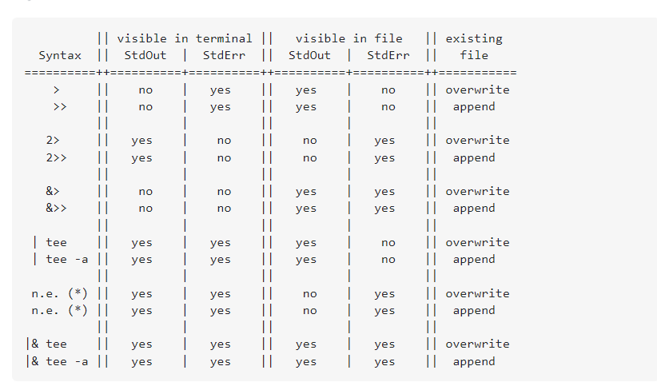

# adv-4000 course commands and info

## Working with files.

### Reading files

1. `cat <filename>` - print file

2. `more <filename>` - print file but in the interactive scroll mode. Useful when file has large content

3. `less <filename>` - similar to more scroll mode bottom/top, but can search words.

### Create files

1. `touch <filename | dirname>` - creates file with specified name
   If we use touch on existing file, it will not change content, but create-date

Also can create directories if we omit file extension.

### Copy files

1. `cp <filename> <path> -v`

Flag '-v' files shows copy process output

Flag '-R' enables recursive mode that can copy nested directory files.

### Remove files

1. `rm <path_to_filename>`

### Rename files

1. `mv <current_filename> <new_filename>`

Can be used to rename files, but also to move ones to other locations.

## Working with directories

### Create directory

1. `mkdir <path_to_new_dir>` - stands for 'make directory'

Flag '-p' allows to create nested directory by specifying <parent_dir/nested_dir>

### Copy, rename or move works the same as files - `mv` and `cp -R`

### Remove directory

1. `rmdir <dir_name` - stands for 'remove directory'.

Removes directory, if only it is empty! 2. `rm -R <dir_name>`
In case we want to remove directory recursively

## Links

### Linked duplicate file

1. `ln` command. Creates duplicate file which content will be synced with original.

### Symbolik link aka shorkcut to directory/file

1. `ln -s` command, creates symbolic link - reference for specified directory or file, like shortcut.

## Search

1. `find <directory> -name "<wildcard>"`

Searches in specified directory files by provided attributes.
For example: `find /home -name "*.txt"`

## Input/output redirecrion

Basically, with the help of redirection operators (> or >>) we can redirect output of any-command result from terminal to specified file.
For example: `ls -l > text.txt`.

Difference between '>' and '>>' - first one will rewrite complete file, second will append output to the end of the file if it's alredy exists.

Sometimes when we use commands we can see error output, for example 'permission denied' output is a error output. We can filter this print result by using output redirection. '>' - is a positive output without error, '2>' - is a error output, '&>' - all output.
Examples:

- `grep user /etc/* 2> /dev/null`.
  Here in case of any output errors, they will be moved to /dev/null file, which means nowhere and we just won't see this output.

- `grep user /etc/* > good.txt 2> nogood.txt`.
  Here all positive output will be written to good.txt file. Error outputs to the nogood.txt file.

- `grep user /etc/* &> results.txt`
  Here every output will be saved to results.txt file no matter if it's an error or positive result

## Other

1. `wc <filename>` - stands for words count

Prints word stats of the specified file. For example: `wc readme.txt`, will show words count, line and symbols count.

Flags:

- '-l' - print lines count
- '-w' - print words count
- '-s' - print symbols count

2. `sort <filename>`

Prints file content sorted by chars.

3. `grep -i <search-word> <filename>`

Searches lines with specified world in the specified file.

Flag '-i' turns on case insensetive search mode

Flag '-E' enables regexp search, for example: `grep -E "[A-Za-z\.]*@[A-Za-z]*.com"` - regexp for email regexp.
